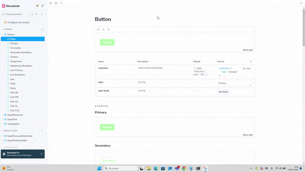

# Storybook Library

This project is a **UI library** developed using **Next.js** with a focus on **reusability** and **scalability**. The library currently includes a mix of atomic design elements categorized into **atoms**, **molecules**, and **organisms**.

## Components Overview

### Atoms
- **InputText**: A basic text input field.
- **InputPassword**: A password input field.
- **Button**: A customizable button component.
- **Typography**: Text elements for consistent styling.

### Molecules
- **InputTextController**: A controlled version of the InputText component.
- **InputPasswordController**: A controlled version of the InputPassword component.

### Organisms
- **BoostForm**: A dynamic and configurable form component.

## Technologies Used
- **PrimeReact (Unstyled mode)**: For component functionality without predefined styles.
- **Tailwind CSS**: For styling and design consistency.
- **React Testing Library**: For unit and integration testing.
## Demo

### Button stories

This library is being developed with **Storybook**, which serves as an interactive platform to preview components and their use cases.

